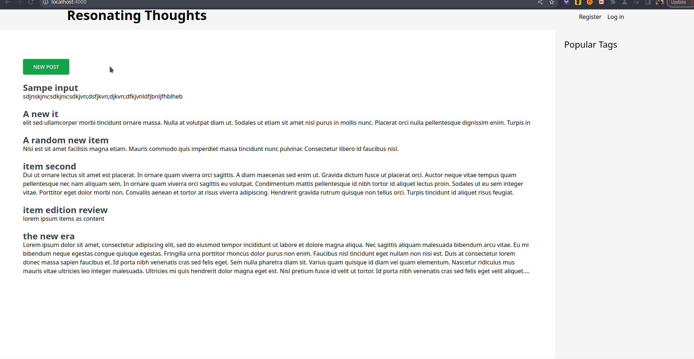

# CommunityWrites

> A community-driven publishing platform

## Local setup

To start your Phoenix server:

  * Install dependencies with `mix deps.get`
  * Create and migrate your database with `mix ecto.setup`
  * Start Phoenix endpoint with `mix phx.server` or inside IEx with `iex -S mix phx.server`

Visit [`localhost:4000`](http://localhost:4000) from your browser.

## Project path

**Project board:** 
[Kanban](https://github.com/users/MarvinKweyu/projects/5/views/1)
